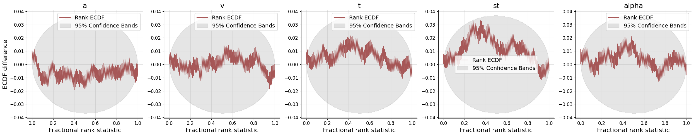
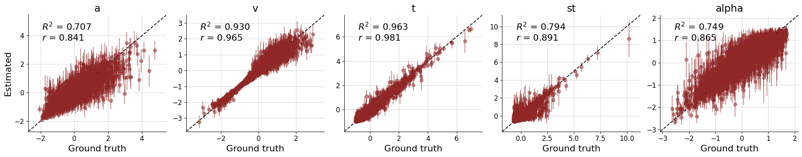
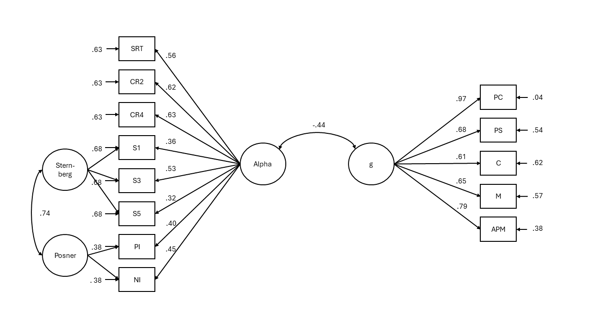

```{r setup, include = FALSE}
# Working directory
knitr::opts_knit$set(root.dir = rprojroot::find_rstudio_root_file())

# disallow tables breaking over pages
knitr::opts_chunk$set(ft.keepnext = TRUE,
                      ft.align = "left",
                      ft.latex.float = "float")
# Seed for random number generation
set.seed(1234)
knitr::opts_chunk$set(cache.extra = knitr::rand_seed) # this adds random seed to all chunks
knitr::opts_chunk$set(autodep = TRUE)
knitr::dep_auto()
library(papaja)
source("helper_functions.R")
source("investigating_results.R")
source("sem_levy_models.R")

r_refs("r-references.bib")

r_citations <- cite_r(
  file = "r-references.bib",
  pkgs = c("papaja", "tidyverse", "knitr", "rmarkdown", "lavaan", "flextable"),
  omit = FALSE,
  footnote = TRUE
  )
```

<!-- Setup -->
<!-- Maybe setup R libraries here -->

<!-- Here we can incorporate child markdown-documents as the separate parts -->
# Introduction
- Intelligence and mental speed, which processes play a role here. 

- Traditionally, is investigated by using cognitive models. This shows impact of drift rate on intelligence. Other parameters not that strong

- but what parts of mental speed? Variability aswell? @doebler2016relationship shows consistent negative relationships between the variability of RT and intelligence in Hick tasks (the more variable, the less intelligent)

- DDM and its contribution to intelligence

- extension to levy-flight

- hypothesis about alpha and intelligence

- Aim of this study?

- should use multiple tasks (@schubert2016trait)

# Methods
## Participants
The data I analyse here was published in @schubert2017general. The original study consisted of three measurement occasions and included EEG measurements in the first and last measurement occasion. The present analysis focuses on the behavioral data collected during the first two measurement occasions. The sample consists of N = 122 (72 female, $M_{age} = 36.7, SD_{age} = 13.6$) participants. All of the participants had normal or corrected to normal vision, no history of mental illness, provided informed consent, and received 100€ for their participation. 

## Materials
I will focus on behavioral data from the Hick, Sternberg, and Posner Tasks. Detailed information can be found in the original publication [@schubert2017general].

Intelligence was measured using a computer-adapted version of Raven's Advanced Progressive Matrices (APM) [@raven1981manual] and the Berlin Intelligence Structure Test (BIS) [@jager1997berliner].

## Procedure
The first two measurement occasions were spaced approximately four months apart. The Hick, Sternberg, and Posner Tasks were administered at the first measurement occasion in the same order for all participants. The APM and BIS were administered at the second measurement occasion.

## Analysis
### Levy-Flight Model
I estimated the parameters of the Levy-Flight model using BayesFlow [@radev2020bayesflow]. I used accuracy coding, with the upper boundary representing a correct response and the lower boundary representing an incorrect response. Hence, I fixed the start point $z$ to 0.5. I allowed drift rate $v$, boundary separation $a$, non-decision time $t0$, variability in the non-decision time $st0$ and $\alpha$ to vary between tasks and conditions.

To train the neural approximator, I employed the following priors:
$$v \sim Normal(3,3)$$
$$a \sim Gamma(5, 2) + 0.1$$
$$t0 \sim Gamma(1, 3) + 0.1$$
$$st0 \sim Beta(1, 3) \cdot 2 \cdot t0$$
$$\alpha \sim Beta(4, 2) \cdot 2$$
I simulated 200,000 datasets and then trained the model for 150 epochs. After training, I investigated the computational faithfulness of the neural network by using simulation-based calibration [@talts2018validating]. I investigated the bias of the posterior distributions after applying the amortized inference network on newly simulated data. Furthermore, I investigated the ability of the model to recover true generating parameters by comparing the posterior mean to the true parameters used in simulation.

### Structural Equation Model
I used structural equation modelling to evaluate the correlation between a latent first order factors of the alpha parameter over all tasks and a g factor over all intelligence measures. In addition to the first order factor over all tasks and conditions, I included task-specific method factors. Intelligence was defined as a first order factor over all sub-tests of the BIS as well as the APM. I then investigated the relationship between latent the latent factors alpha and g.

# Results
Model estimation was done in Python 3.11 with Bayesflow version 1.1.6 [@radev2020bayesflow]. Data analysis was done in `r r_citations$r`. `r r_citations$pkgs`

I excluded all response times which deviated more than 3 standard deviations from the mean response time for a given participant in a given condition. This removed `r round(hick_data_removed*100, 2)` % of the data in the Hick task, `r round(posner_data_removed*100, 2)` % of the data in the Posner task, and `r round(sternberg_data_removed*100, 2)` % of the data in the Sternberg task. No further data-pruning was applied.

## Levy Flight Model estimation
The inference net showed no sign of bias in posterior estimation (see Figure \@ref(fig:results-bf-bias)). It also displayed acceptable recovery of true generating parameters (see Figure \@ref(fig:results-bf-recovery)).

(ref:results-bf-bias) Empirical Cumulative Density Functions of Rank Statistics
```{r results-bf-bias, fig.cap = paste("(ref:results-bf-bias)")}

```

(ref:results-bf-recovery) Recovery of true model parameters
```{r results-bf-recovery, fig.cap = paste("(ref:results-bf-recovery)")}

```

## Relationship of alpha and g
On a bivariate level, alpha displayed consistently negative correlations with all cognitive performance measures (see Figure \@ref(fig:results-bivariate-plot)). Averaged over tasks and conditions, alpha showed a correlation with performance in the APM of $r =$`r results %>% filter(measure == "APM", param == "alpha") %>% pull(cor) %>% fisher_cor_mean()` and $r =$`r results %>% filter(measure == "BIS", param == "alpha") %>% pull(cor) %>% fisher_cor_mean()` in the BIS.

(ref:results-bivariate-plot) Bivariate Correlation between parameters and cognitive performance
```{r results-bivariate-plot, fig.cap = paste("(ref:results-bivariate-plot)")}
plot_by_measure
```

## SEM
The measurement model with method factors for all three tasks failed to fit. This full model always estimated the variance of one of the method factors to be negative. I therefore excluded one of the method factors from the model [@steyer1999latent] and only retained a factor for the Sternberg and Posner Task.

The model showed acceptable fit `r print_sem(alpha_g)` and can be seen in Figure \@ref(fig:results-sem-alpha). On a latent level alpha and g correlated to $-0.44$. 

(ref:results-sem-alpha) Structural Equation Model of Alpha and Intelligence
```{r results-sem-alpha, fig.cap = paste("(ref:results-sem-alpha)")}

```

# Discussion
Low correlations, but negative direction. Need to extend this to more difficult tasks. (Sternberg may already be a difficult task)

We used the SEM to measure trait alpha across tasks, as recommended in @schubert2016trait

This is in contrast to the findings that less variable results are found in more intelligent individuals
maybe in the ongoing variability discussion
<!-- References -->

\newpage

# References
::: {#refs custom-style="Bibliography"}
:::

