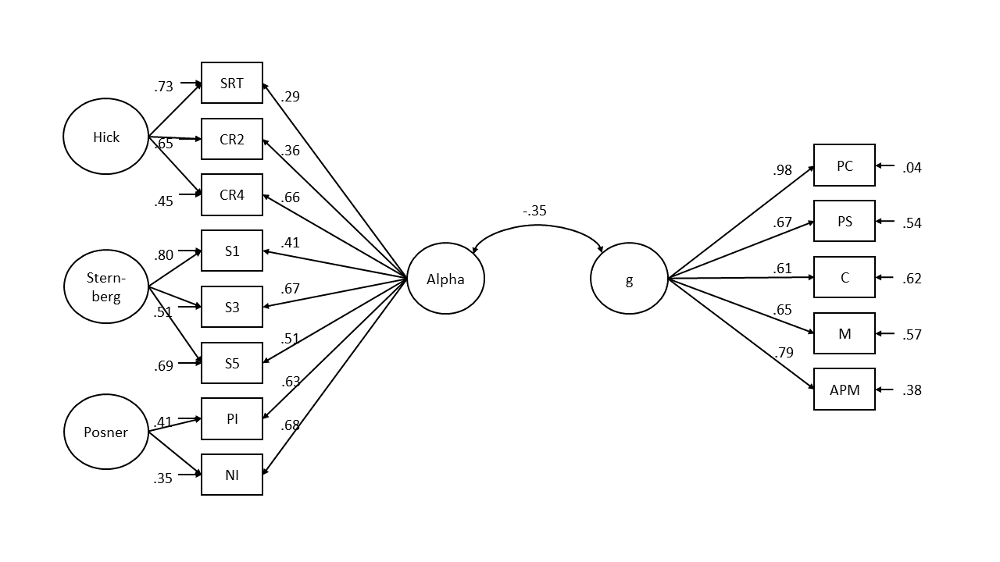

```{r setup, include = FALSE}
# Working directory
knitr::opts_knit$set(root.dir = rprojroot::find_rstudio_root_file())

# disallow tables breaking over pages
knitr::opts_chunk$set(ft.keepnext = TRUE,
                      ft.align = "left",
                      ft.latex.float = "float")
# Seed for random number generation
set.seed(1234)
knitr::opts_chunk$set(cache.extra = knitr::rand_seed) # this adds random seed to all chunks
knitr::opts_chunk$set(autodep = TRUE)
knitr::dep_auto()
library(papaja)
source("helper_functions.R")
source("investigating_results.R")
source("sem_levy_models.R")

r_refs("r-references.bib")

r_citations <- cite_r(
  file = "r-references.bib",
  pkgs = c("papaja", "tidyverse", "knitr", "rmarkdown", "lavaan", "flextable"),
  omit = FALSE,
  footnote = TRUE
  )
```

<!-- Setup -->
<!-- Maybe setup R libraries here -->

<!-- Here we can incorporate child markdown-documents as the separate parts -->
# Introduction
Intelligence is one of the most well researched constructs in psychology, playing a crucial role in predicting success in education, job performance, and overall well-being [ZIT]. Understanding the cognitive processes that underpin intelligence has been the focus of decades of research. One of the most robust findings in this area is the relationship between measures of mental speed and intelligence, with faster cognitive processing often associated with higher intelligence.

In a review of 172 studies, @sheppard2008intelligence reported an average correlation of $r = -.24$ between various mental speed measures and various intelligence measures. Most studies investigating the relationship between intelligence and mental speed use elementary cognitive tasks (ECTs) to obtain a measure of mental speed. ECTs are simple tasks with very low cognitive demands. For example, participants have to respond by key-press in which of two squares a stimulus has appeared. This limits the role of individual differences in strategy and allows researchers to obtain a pure measure of mental speed.

Mental speed is assessed at different levels: behaviorally, through psychophysiological measures, or via cognitive models. On a behavioral level, researchers find robust negative correlations between intelligence and both mean response time and variability of response time [@jensen2006clocking; @doebler2016relationship]. More intelligent individuals tend to have lower mean response times and lower variability in response times. Using EEG measures, @schubert2017general found that the latency of event-related potentials are able to explain 80% of the variance in intelligence. In cognitive models, evidence accumulation models like the drift-diffusion model (DDM) [@ratcliff2008diffusion] are employed to obtain model parameters of mental speed. 

The DDM assumes that participants steadily accumulate evidence during a trial. Once they have accumulated enough evidence pointing towards a response, a decision and subsequent reaction is made.
The model attempts to fit the empirical distribution of response times and accuracies by optimizing several different parameters. First, response time is separated into decision time, where the noisy evidence accumulation process takes place, and non-decision time $T_{er}$. Non-decision time incorporates processes such as stimulus encoding and motor processes. Decision time is further controlled by three main parameters: (1) the boundary separation $a$ describes the distance between decision boundaries and represents the amount of evidence required to reach a decision, (2) the mean drift rate $v$ is the average rate at which evidence is accumulated and (3) the mean starting point _z_ represents the average point at which the evidence accumulation process begins and can account for an a-priori bias towards one of the two-choice alternatives. 

Further parameters of across-trial variability can be added to reflect changes in diffusion model parameters over time. Variability of the starting point _s~z~_ accounts for differences in a-priori bias towards one response alternative across trials [@laming1968information; @ratcliff1998modeling]. Variability of drift rate $\eta$ reflects changes in drift rate across trials and allows the model to account for systematic differences between trials, such as error responses being systematically faster than correct responses [@ratcliff1978theory; @ratcliff1998modeling]. Finally, variability of non-decision time _s~t~_ reflects fluctuations in the duration of encoding or motor-execution processes across trials.

Of these parameters, drift rate has so far shown the most robust correlation to intelligence [@schubert2015decomposing; @schmiedek2007individual; @ratcliff2011effects]. Boundary separation is often negatively associated with intelligence, but the effect is smaller than for drift rates [@schubert2015decomposing; @ratcliff2011effects].

In both the simple and full DDM, the drift rate is an average rate of evidence accumulation. In each step, this average rate is influenced by noise, resulting in the random walk with a certain drift that characterizes the evidence accumulation process. This noise is assumed to be normally distributed with a mean of 0. The standard deviation of the noise distribution is the "diffusion constant" and is set to 1 in most applications.

Under the assumption that noise is normally distributed, large jumps in accumulated evidence become very unlikely. Recently, @voss2019sequential introduced an extension of the DDM that modifies the noise distribution. Here, the normal distribution is replaced by a heavy tailed distribution. This increases the likelihood of larger jumps occurring in the evidence accumulation process. The Cauchy distribution is an example of such a heavy-tailed distribution. Both the Cauchy distribution and the normal distribution are specific instances of the family of so-called Levy alpha-stable distributions. Within this family, a stability parameter $\alpha$ governs the heaviness in the tails of the distribution. $\alpha$ = 2 results in the normal distribution, $\alpha$ = 1 results in the Cauchy distribution. In the Levy-flight model, $\alpha$ is an additional parameter that can be estimated from the data [@voss2019sequential; @wieschen2020jumping]. 

Higher values of $\alpha$ lead to more stable evidence accumulation with fewer jumps. Lower values of $alpha$ lead to less stable evidence accumulation, showing more extreme jumps. In behavioral data, higher variability of response times is associated with lower intelligence [@doebler2016relationship]. Intelligent individuals are more "stable" in their response times. Following these findings, higher values of alpha may be positively associated with intelligence. @wieschen2020jumping refers to this as the "inefficient jumping" hypothesis. The jumps in evidence accumulation more common in heavy-tailed noise distributions are deemed inefficient while completing the response time task. Intelligent individuals should therefore display fewer inefficient jumps and thus have higher values of $\alpha$.

Contrasting this, jumps in evidence accumulation may also be beneficial. In simple response time tasks with high accuracy, erratically accumulating information may be an efficient way to decrease response times. This is termed the "efficient jumping" hypothesis [@wieschen2020jumping]. The efficient jumping hypothesis claims that more intelligent individuals make use of larger jumps in evidence accumulation to complete the task more quickly. They should therefore display lower values of $\alpha$.

This present work aims to provide a first insight into the question of efficient vs. inefficient jumping. To this end, I applied the Levy-flight model to data from three different response time tasks and investigated the correlation between the $\alpha$ parameter and intelligence. Following @schubert2016trait, I used structural equation modeling to obtain a latent factor for both $\alpha$ and intelligence to account for measurement error. 

The inefficient jumping hypothesis predicts positive latent correlations between $\alpha$ and _g_. More intelligent individuals display smaller heavy-tails. The efficient jumping hypothesis predicts negative correlations between $\alpha$ and _g_. More intelligent individuals make efficient use of jumps in evidence accumulation and thus display heavier tails.

# Methods
## Participants
The data I analyse here was published in @schubert2017general. The original study consisted of three measurement occasions and included EEG measurements in the first and last measurement occasion. The present analysis focuses on the behavioral data collected during the first two measurement occasions. The sample consists of N = 122 (72 female, $M_{age} = 36.7, SD_{age} = 13.6$) participants. All of the participants had normal or corrected to normal vision, no history of mental illness, provided informed consent, and received 100€ for their participation. 

## Materials
I will focus on behavioral data from the Hick, Sternberg, and Posner Tasks. Detailed information can be found in the original publication [@schubert2017general].

Intelligence was measured using a computer-adapted version of Raven's Advanced Progressive Matrices (APM) [@raven1981manual] and the Berlin Intelligence Structure Test (BIS) [@jager1997berliner].

## Procedure
The first two measurement occasions were spaced approximately four months apart. The Hick, Sternberg, and Posner Tasks were administered at the first measurement occasion in the same order for all participants. The APM and BIS were administered at the second measurement occasion.

## Analysis
### Levy-Flight Model
I estimated the parameters of the Levy-Flight model using BayesFlow [@radev2020bayesflow]. I used accuracy coding, with the upper boundary representing a correct response and the lower boundary representing an incorrect response. Hence, I fixed the start point $z$ to 0.5. I allowed drift rate $v$, boundary separation $a$, non-decision time $t0$, variability in the non-decision time $st0$ and $\alpha$ to vary between tasks and conditions.

To train the neural approximator, I employed the following priors:
$$v \sim Normal(3,3)$$
$$a \sim Gamma(5, 2) + 0.1$$
$$t0 \sim Gamma(1, 3) + 0.1$$
$$st0 \sim Beta(1, 3) \cdot 2 \cdot t0$$
$$\alpha \sim Beta(4, 2) \cdot 2$$
I simulated 200,000 datasets and then trained the model for 150 epochs. After training, I investigated the computational faithfulness of the neural network by using simulation-based calibration [@talts2018validating]. I investigated the bias of the posterior distributions after applying the amortized inference network on newly simulated data. Furthermore, I investigated the ability of the model to recover true generating parameters by comparing the recovered posterior means to the true parameters used in simulation.

### Structural Equation Model
I used structural equation modelling to evaluate the correlation between a latent first order factor of the alpha parameter over all tasks and a _g_ factor over all intelligence measures. In addition to the first order factor over all tasks and conditions, I included task-specific method factors. Intelligence was defined as a first order factor over all sub-tests of the BIS as well as the APM. I then investigated the relationship between the latent factors _alpha_ and _g_.

# Results
Model estimation was done in Python 3.11 with Bayesflow version 1.1.6 [@radev2020bayesflow]. Data analysis was done in `r r_citations$r`. `r r_citations$pkgs`

I excluded all response times which deviated more than 3 standard deviations from the mean response time for a given participant in a given condition. This removed `r round(hick_data_removed*100, 2)` % of the data in the Hick task, `r round(posner_data_removed*100, 2)` % of the data in the Posner task, and `r round(sternberg_data_removed*100, 2)` % of the data in the Sternberg task. No further data-pruning was applied.

## Levy Flight Model estimation
The inference net showed no sign of bias in posterior estimation (see Figure \@ref(fig:results-bf-bias)). It also displayed acceptable recovery of true generating parameters (see Figure \@ref(fig:results-bf-recovery)).

(ref:results-bf-bias) Empirical Cumulative Density Functions of Rank Statistics
```{r results-bf-bias, fig.cap = paste("(ref:results-bf-bias)")}

```

(ref:results-bf-recovery) Recovery of true model parameters
```{r results-bf-recovery, fig.cap = paste("(ref:results-bf-recovery)")}

```

## Relationship of alpha and g
On a bivariate level, alpha displayed consistently negative correlations with all cognitive performance measures (see Figure \@ref(fig:results-bivariate-plot)). Averaged over tasks and conditions, alpha showed a correlation with performance in the APM of $r =$`r results %>% filter(measure == "APM", param == "alpha") %>% pull(cor) %>% fisher_cor_mean()` and $r =$`r results %>% filter(measure == "BIS", param == "alpha") %>% pull(cor) %>% fisher_cor_mean()` in the BIS.

(ref:results-bivariate-plot) Bivariate Correlation between parameters and cognitive performance
```{r results-bivariate-plot, fig.cap = paste("(ref:results-bivariate-plot)")}
plot_by_measure
```

## SEM
The measurement model with method factors for all three tasks failed to fit. This full model always estimated the variance of one of the method factors to be negative. I therefore excluded one of the method factors from the model [@steyer1999latent] and only retained a factor for the Sternberg and Posner Task.

The model showed acceptable fit `r print_sem(alpha_g)` and can be seen in Figure \@ref(fig:results-sem-alpha). On a latent level _alpha_ and _g_ correlated to $-0.44$. 

(ref:results-sem-alpha) Structural equation model of the relationship between alpha and intelligence
```{r results-sem-alpha, fig.cap = paste("(ref:results-sem-alpha)")}

```

# Discussion
Low correlations, but negative direction. This would mean that... 

We used the SEM to measure trait alpha across tasks, as recommended in @schubert2016trait. our findings support the notion that you should do that

However, Need to extend this to more difficult tasks. (Sternberg may already be a difficult task)


This is in contrast to the findings that less variable results are found in more intelligent individuals
maybe in the ongoing variability discussion

Limitations: Tasks, intelligence measures (BIS), but probably fine with APM latency, no "difficult" tasks

<!-- References -->
\newpage

# References
::: {#refs custom-style="Bibliography"}
:::

